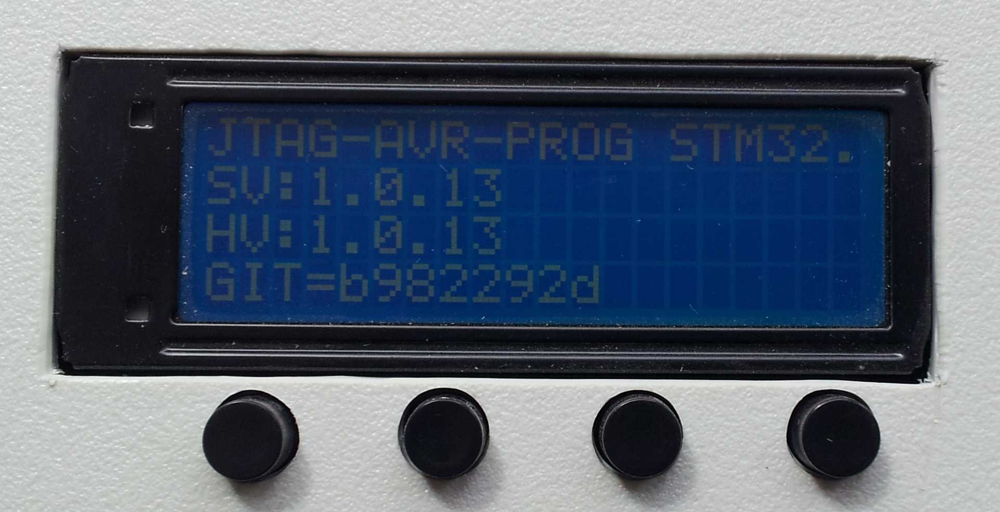
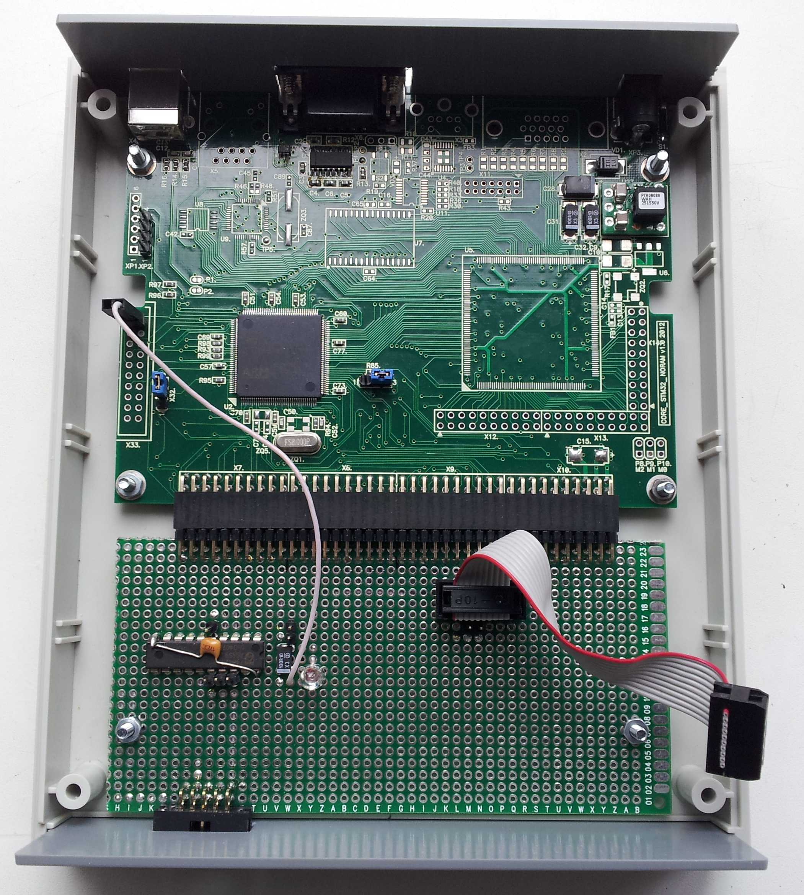
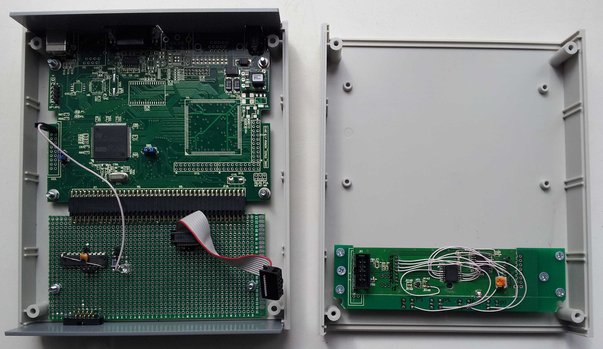

# jtag_avr
Standalone programmer of microcontrollers avr

1. Build AVR prj to firmware HEX, converting to AVR.BIN.
2. PC_VS2008: Add header to AVR.BIN. cmd line parameter.
3. Load AVR.BIN to STM32 programmer in X-Modem protocol.
4. STM32 programmer connecting to AVR board and Power ON (Prog & board). 
5. STM32 programmer select firmware (from menu) and press run prog (from menu).

